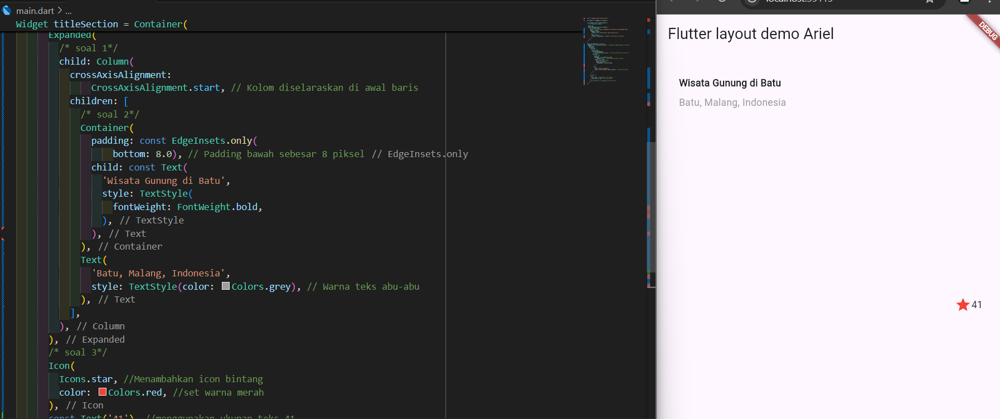
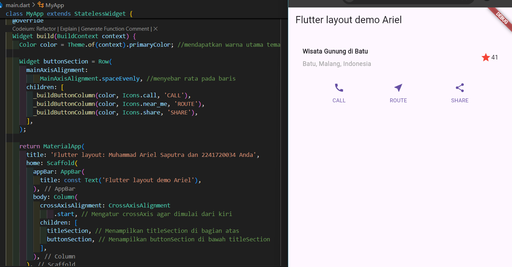
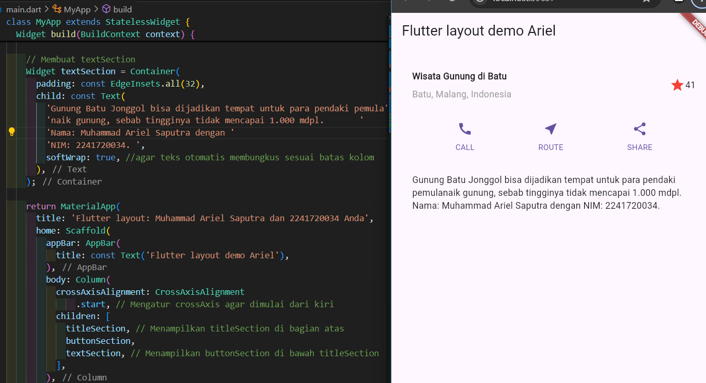
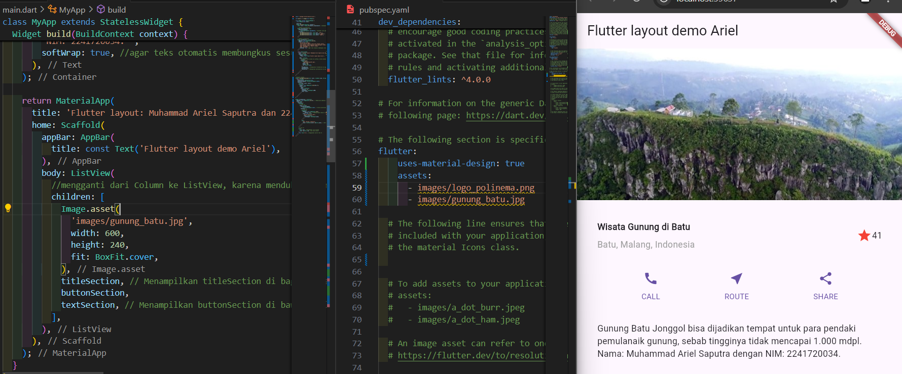
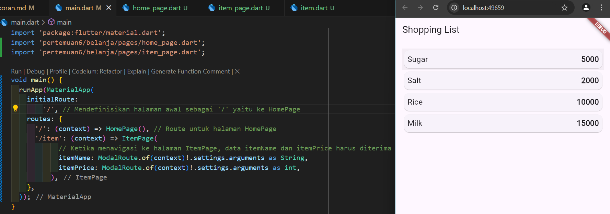
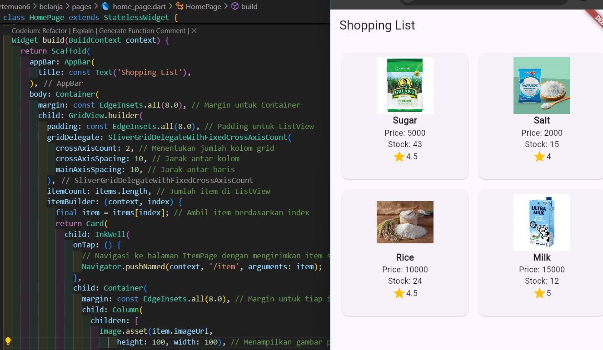
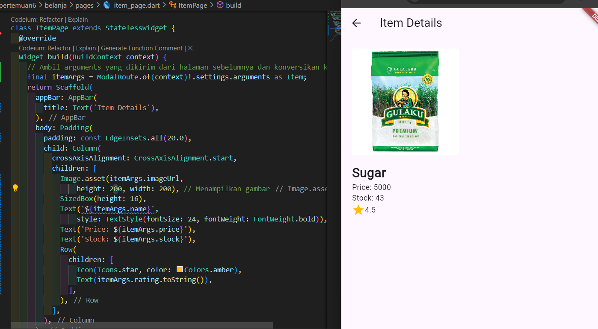

# **Pertemuan 6 - Layout dan Navigasi**
 

### **Praktikum 1: Membangun Layout di Flutter**
**Soal 1, 2, 3**

### **Praktikum 2: Implementasi button row**

### **Praktikum 3: Implementasi text section**

### **Praktikum 4: Implementasi image section**

### **Praktikum 5: Membangun Navigasi di Flutter**

## **Tugas Praktikum 2**

**Soal 1,2, dan 3**  
HomePage  
  
ItemPage  
  

