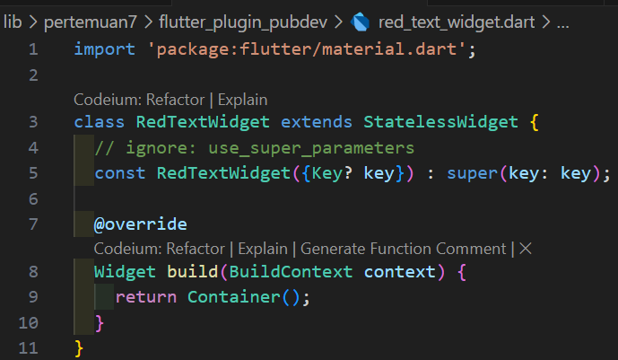
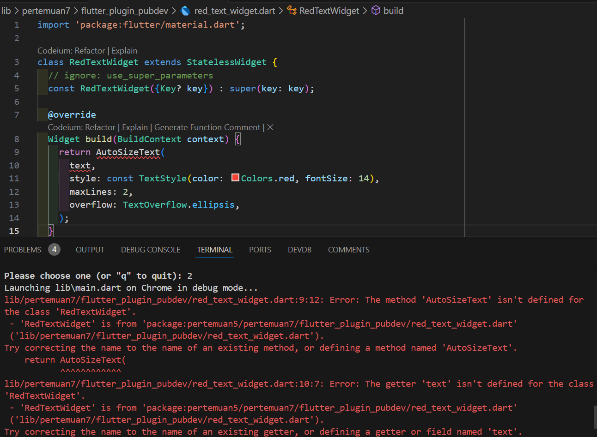
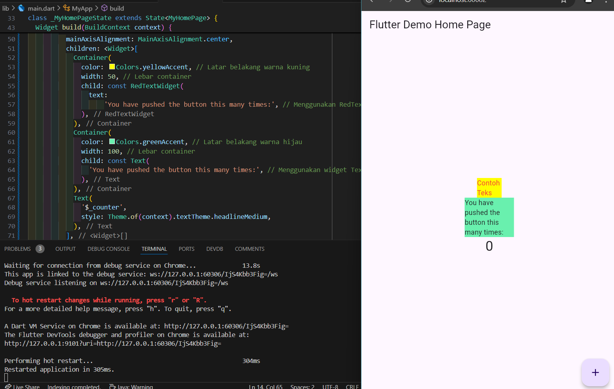

# **Pertemuan 7 - Manajemen Plugin**
 

#### **Langkah 1, 2, 3**

#### **Langkah 4**
  
**Penjelasan Error:** Error terjadi karena Flutter tidak mengenali plugin AutoSizeText akibat import yang belum ditambahkan, dan juga variabel text yang belum terdefinisi di dalam widget.

#### **Langkah 6**
   

### **Tugas Praktikum**
2. Jelaskan maksud dari langkah 2 pada praktikum tersebut!  
**Jawaban:** Bertujuan untuk mengimpor pustaka eksternal yang dapat digunakan dalam project Flutter untuk secara otomatis menyesuaikan ukuran teks agar sesuai dengan batas atau lebar container yang ditentukan. Setelah perintah ini dijalankan, plugin auto_size_text ditambahkan ke file pubspec.yaml di bagian dependencies, yang memungkinkan Flutter untuk mendownload dan mengintegrasikan plugin tersebut dalam project.  

3. Jelaskan maksud dari langkah 5 pada praktikum tersebut!  
**Jawaban:** bertujuan untuk menambahkan variabel text ke dalam class RedTextWidget dan memastikannya menjadi parameter yang wajib diisi (required) saat widget ini digunakan.  

4. Pada langkah 6 terdapat dua widget yang ditambahkan, jelaskan fungsi dan perbedaannya!  
**Jawaban:**  
**RedTextWidget:** Teks yang ditampilkan oleh widget ini diatur agar berwarna merah dan akan menyesuaikan ukuran teks secara otomatis. Fungsi utama: Menampilkan teks yang panjang dengan ukuran font yang otomatis menyesuaikan berdasarkan lebar container dan maksimal baris yang diizinkan (maxLines).  
**Text:** Widget Text adalah widget bawaan dari Flutter yang berfungsi untuk menampilkan teks statis tanpa kemampuan penyesuaian otomatis ukuran teks. 
Fungsi utama: Menampilkan teks dengan ukuran dan gaya yang ditentukan, tetapi tidak memiliki kemampuan untuk menyesuaikan ukuran teks jika terlalu panjang, yang bisa menyebabkan teks terpotong atau meluber keluar container.  
**Perbedaan Utama:**  
*RedTextWidget* menggunakan AutoSizeText yang secara otomatis mengurangi ukuran font teks agar sesuai dengan batas ruang yang tersedia di container.  
*Text* adalah widget standar Flutter yang menampilkan teks dengan ukuran tetap, tanpa fitur otomatis penyesuaian ukuran. 
5. Jelaskan maksud dari tiap parameter yang ada di dalam plugin auto_size_text berdasarkan tautan pada dokumentasi [ini](https://pub.dev/documentation/auto_size_text/latest/) !  
**Jawaban:**  
**a. text:** Ini adalah teks yang akan ditampilkan di widget AutoSizeText. Teks ini dapat disesuaikan ukurannya secara otomatis agar sesuai dengan batas lebar container.  
**b. style:** Berfungsi untuk menentukan gaya teks (seperti warna, ukuran font, ketebalan huruf). Misalnya, dalam kode yang digunakan, teks diatur agar berwarna merah dengan ukuran font awal 14.  
**c. maxLines:** Parameter ini mengatur jumlah maksimal baris yang bisa digunakan untuk menampilkan teks. Jika teks melebihi jumlah baris ini, ukuran font akan dikurangi hingga teks sesuai di dalam batasan ini. Jika teks masih terlalu panjang setelah penyesuaian, maka akan dipotong (dengan atau tanpa elipsis tergantung pengaturan).  
**d. overflow:** Mengatur bagaimana teks yang tidak muat di container ditampilkan. Misalnya, TextOverflow.ellipsis akan menampilkan tanda titik-titik (...) di akhir teks jika teks terpotong.  
**e. minFontSize:** Mengatur ukuran font minimum yang bisa dicapai saat auto-size mengurangi ukuran teks. Ini berguna untuk mencegah teks terlalu kecil dan tidak terbaca. Jika teks masih tidak muat meskipun ukuran font sudah mencapai batas minimum, maka teks akan terpotong.  
**f. maxFontSize:** Menentukan ukuran font maksimum yang dapat digunakan. Ini menghindari teks menjadi terlalu besar saat ada ruang lebih.  
**g. stepGranularity:** Mengatur tingkat pengurangan ukuran font saat auto-size mencoba menyesuaikan teks dengan ruang yang tersedia. Semakin kecil nilainya, semakin halus penyesuaiannya.  
**h. presetFontSizes:** Parameter ini memungkinkan Anda menetapkan beberapa ukuran font yang spesifik untuk dipilih oleh widget secara otomatis berdasarkan ruang yang tersedia.